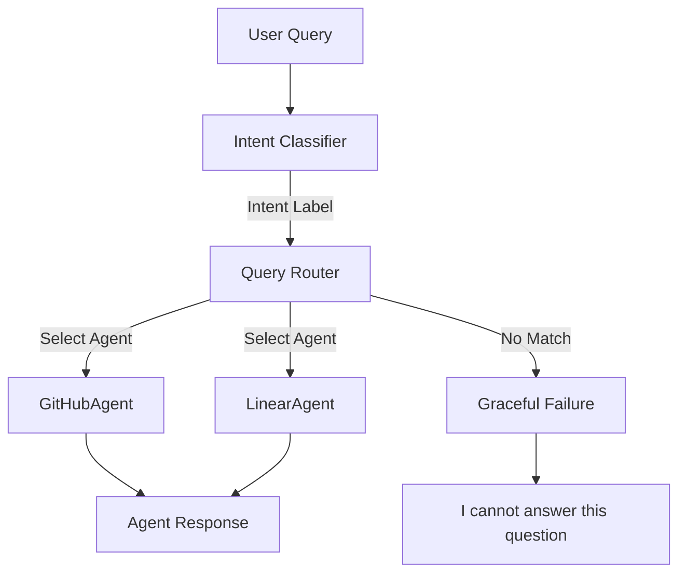

#  StackGen Query Router

> **A clean, extensible, agent-based query routing system that mimics how modern AI platforms dispatch user requests to the correct tools or agents.**

---

##  Overview

**StackGen Query Router** is a lightweight, CLI-based system designed to demonstrate the core logic of AI agent orchestration. It illustrates how user queries can be:

* **Understood** via intent classification.
* **Routed** to the correct domain agent.
* **Handled** by modular, isolated components.
* **Failed gracefully** when no suitable agent exists.

The project is intentionally simple yet architecturally sound, reflecting how AI-adjacent routing systems are designed in real production environments.

##  What Problem Does This Solve?
This project simulates that **decision layer**—the logic that determines *who* should answer the user before any API call is made.

---
##  Intent Classification Strategy (Score-Based Routing)

The system uses a **simple score-based intent classification** approach to route user queries to the correct agent.

Instead of relying on a single keyword match, each intent is associated with a list of keywords.  
The classifier computes a **score for each intent** based on how many of its keywords appear in the user query, and selects the intent with the highest score.

### How It Works

1. The user query is converted to lowercase.
2. For each intent (e.g. `github`, `linear`), the classifier:
   - Counts how many intent-specific keywords appear in the query.
3. The intent with the highest keyword match score is selected.
4. If no intent receives a positive score, the query is treated as unsupported.

### Example

```plaintext
Query: "Show my assigned pull request issues on github"
github keywords matched: "pull request", "github" → score = 2 
linear keywords matched: "issue" → score = 1
```
(This returns Github_Agent because of the score of github agent > score of linear agent)

In cases of ties or overlaps, the router deterministically selects the highest-scoring intent based on the configured keyword sets (Python returns the FIRST key with the maximum value).
---

##  System Architecture

The system follows a linear routing flow:



## Project Structure
```bash
Stackgen_query_router/
├── agents/
│   ├── base_agent.py        # Common agent interface
│   ├── github_agent.py      # Mock GitHub agent
│   └── linear_agent.py      # Mock Linear agent
│
├── router/
│   ├── intent_classifier.py # Intent detection logic
│   └── query_router.py      # Core routing orchestration
│
├── core/
│   ├── logger.py            # Centralized logging
│   └── exceptions.py        # Custom exception hierarchy
│
├── tests/
│   └── test_router.py       # Minimal routing tests
│
├── main.py                  # CLI entry point
├── README.md
└── requirements.txt
└── pytest.ini

```

##  Installation

1. Clone the Repository

```bash
git clone https://github.com/siddhamapple/Stackgen_query_router.git
cd Stackgen_query_router
```

2. Install Dependencies

```bash
pip install -r requirements.txt
```

3. Usage
### Start the CLI
```bash
python main.py
```

## Example Session
```bash
>> Show my open pull requests
2025-12-26 16:21:05,659 | INFO | router | Routing query to GitHubAgent
You have 2 open pull requests and 1 pending review.

>> What issues are assigned to me?
2025-12-26 16:21:16,577 | INFO | router | Routing query to LinearAgent
You have 3 issues assigned to you in Linear.

>> What's the weather today?
2025-12-26 16:21:26,199 | WARNING | router | No intent matched for query
I cannot answer this question.

```
Type exit to quit.


## Running Tests
To run the automated test suite:

```bash
pytest
``` 

### What Is Tested

✔ Correct agent routing

✔ Proper handling of unsupported queries


## ➕ How to Add a New Agent

This project is designed to be easily extensible. Adding a new agent requires **minimal changes** and does **not** affect existing agents or the CLI.

Below is an example of adding a new `JiraAgent`.

---

### Step 1️: Create a New Agent

Create a new file inside the `agents/` directory.

 `agents/jira_agent.py` (for documentation example, let the new agent be jira)

```python
from agents.base_agent import BaseAgent


class JiraAgent(BaseAgent):
    """
    Mock agent for Jira-related queries.
    """

    def handle(self, query: str) -> str:
        return "You have 5 Jira tickets assigned to you."

```
### Step 2️: Register the Agent in the Router

Open:  `router/query_router.py`

Import the new agent:

`from agents.jira_agent import JiraAgent `   


Register it in the agent registry:

```python
AGENT_REGISTRY = {
    "github": GitHubAgent(),
    "linear": LinearAgent(),
    "jira": JiraAgent(),
}
```

### Step 3️ Update Intent Classification

Open: `router/intent_classifier.py`

Add Jira-related intent rules:

```python
if "jira" in query or "ticket" in query:
    return "jira"
```


## Author
Siddham Jain

